# BlogSite Manager

BlogSite Manager provides users with a blog management system to manage the entire blog site. This blog management system is designed to provide customers with a blog data management service to facilitate users to perform statistics and manage the data of their blog sites, including but not limited to finding basic information about customers across the site, deleting users, and finding specific groups of customers.

## Features

BlogSite Manager provides two versions of management system, one version is dedicated to the administrators (managers) of the main blog site and is able to manage the information of customers who have registered blog accounts, such as deleting blog customers, modifying the geographic location of blog customers and the type of customers they belong to, and finding customers based on specific information. The other one is designed for customers who have blog accounts. Through this management system, they can manage basic information about their accounts (a client can have many accounts), such as deleting accounts, searching for blog accounts based on specific information, etc.

## Design changes

Compared to the original design, our current design has made many changes to link customers, blog site administrators, and customer accounts more closely, such as the relationship between Manager and Blog Account, the addition of Attribute to Post, etc.

- Attributes: 

- Tables: combine own into blog account table

- Relationships: delete the relationship between Blog Account and Site Manager; own becomes many to one

#

- ER diagrams changes:
    - The current one:
    

    - The original one:
    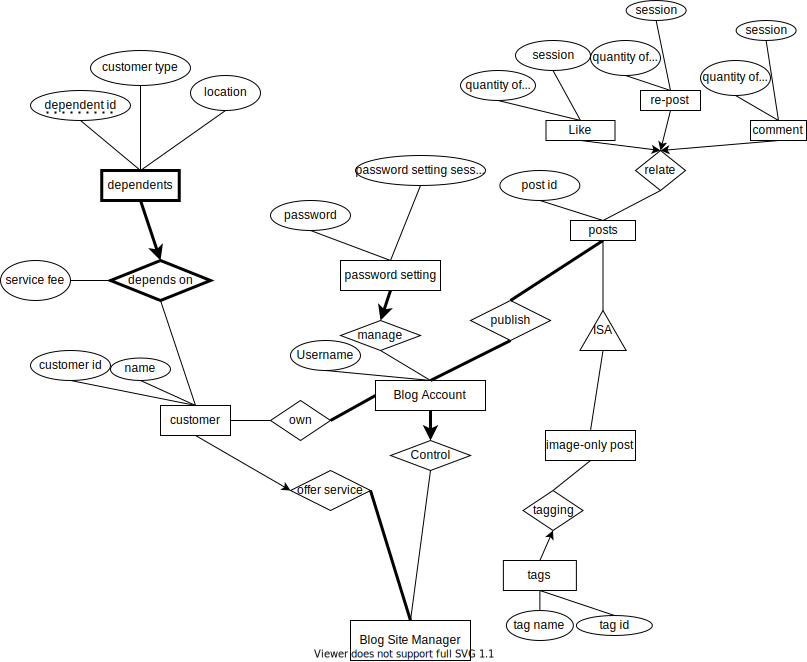

#
# ScreenShots
## Queries: INSERT Operation
In manager.php
- Query:
- Insert into DEPENDENT_FEE values (:bind1, :bind2, :bind3, :bind4)",$AllOrderOne
- insert into CUSTOMER values (:bind1, :bind2, :bind3)", $AllOrder
- insert into CUSTOMER values (:bind1, :bind2, :bind3)", $AllOrder

- before:
  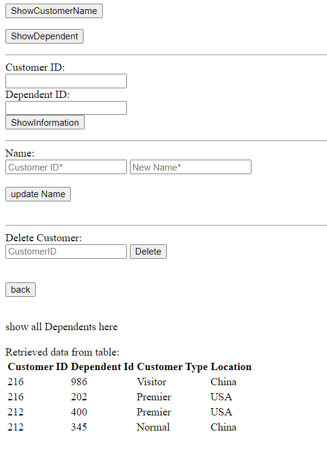
- after:
  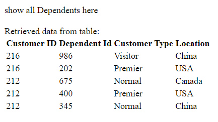
- web:
  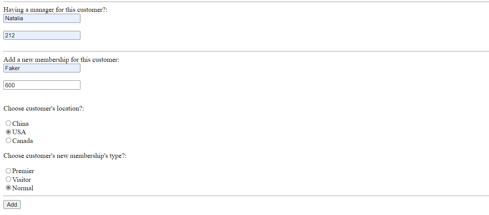

#
#
## Queries: DELETE Operation
- In Customer.php
DELETE FROM POSTS WHERE POSTID = $postID
- Before Deletion:
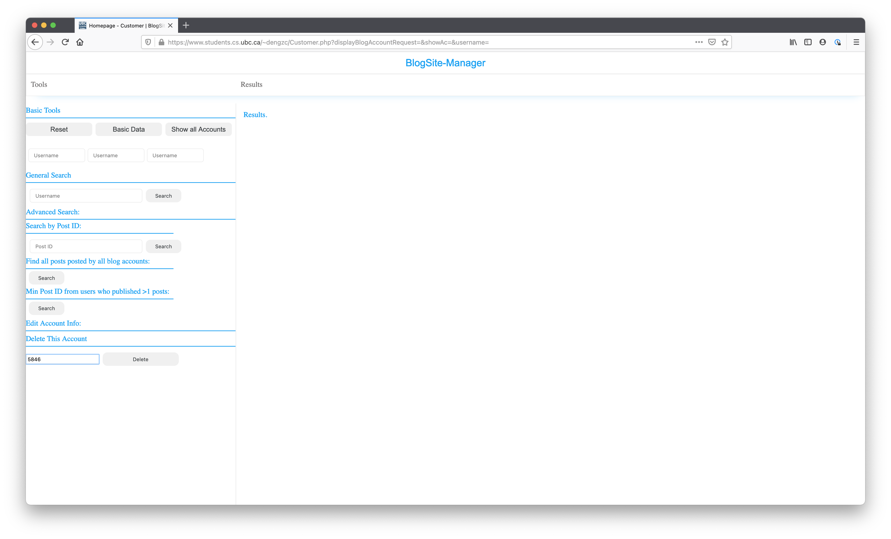

  - The database be like:

    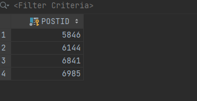

- After Deletion:
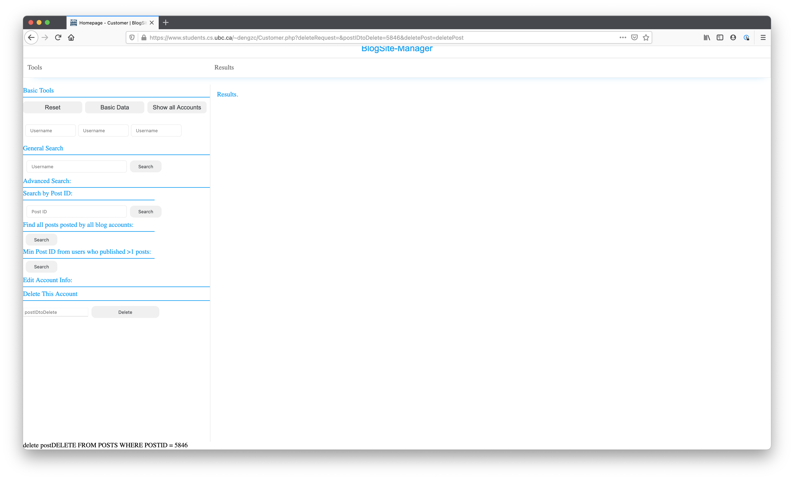

  - The database be like:
    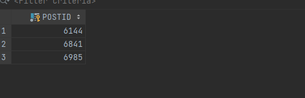
#
## Queries: UPDATE Operation
In managerPlus.php
Query: UPDATE CUSTOMER SET NAME = '$Name' WHERE CustomerID = $CustomerId
- before:
  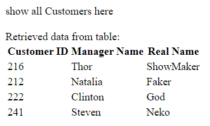
- after:
  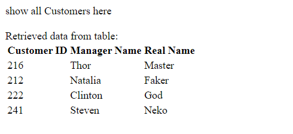
- web:
  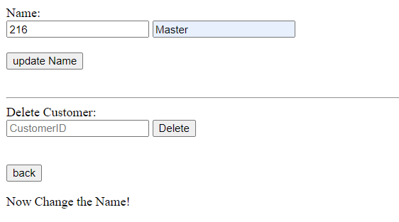

#
## Queries: Selection
In manager.php
Query: SELECT CUSTOMERTYPE, LOCATION, SERVICEFEE FROM CUSTOMERSERVICE

- select for login page
- web:
  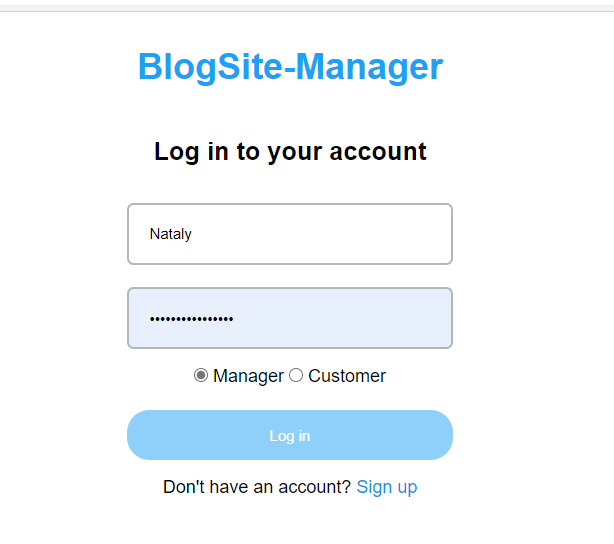
#
## Queries: Projection
-Query
 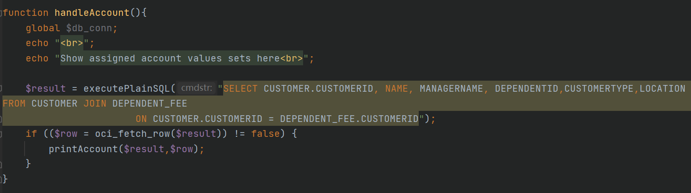

-web
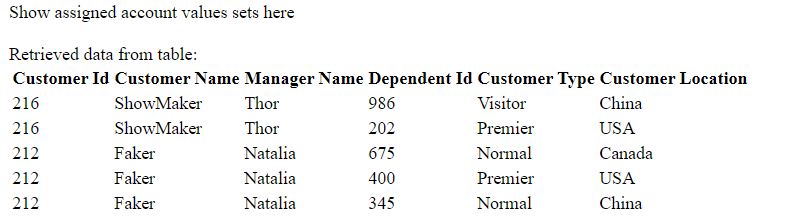

#
## Queries: Join
In managerPlus.php
- Query: SELECT CUSTOMER.CUSTOMERID, NAME, MANAGERNAME, DEPENDENTID,CUSTOMERTYPE,LOCATION
FROM CUSTOMER JOIN DEPENDENT_FEE
ON CUSTOMER.CUSTOMERID = DEPENDENT_FEE.CUSTOMERID
WHERE CUSTOMER.CUSTOMERID = $CustomerId AND DEPENDENTID = $DependentId
- query
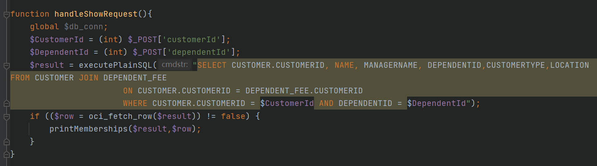
  - web
    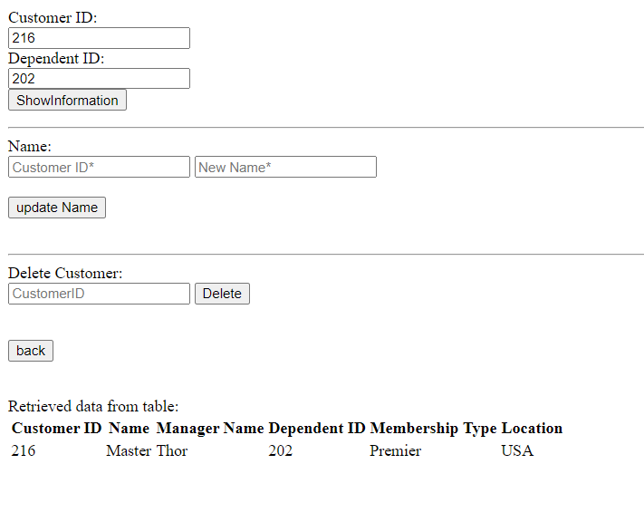

#
## Queries: Aggregation with Group By
In manager.php
- Query: SELECT COUNT(CUSTOMERID),COUNT(DEPENDENTID) ,LOCATION
  FROM DEPENDENT_FEE
  GROUP BY LOCATION
  - query
    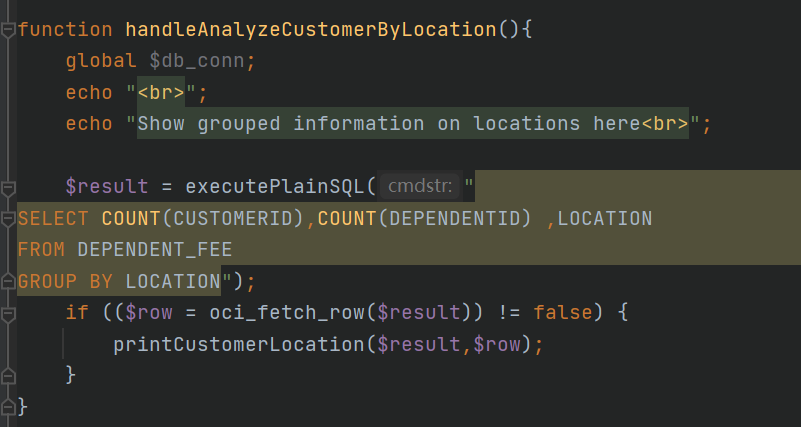
  - web
    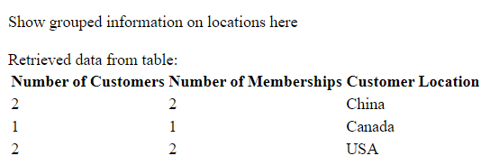

#
## Queries: Aggregation with Having
In manager.php

- query
  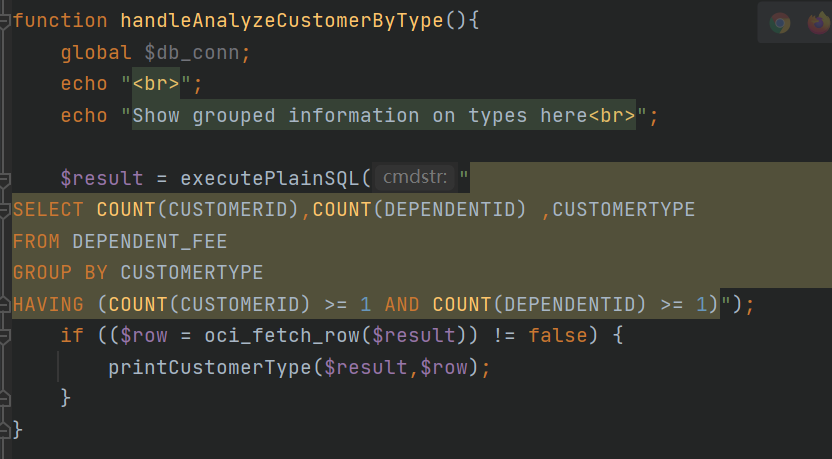
  - web
    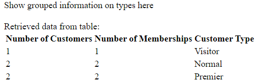

#
## Queries: Nested Aggregation with Group By
In Customer.php
- Query: SELECT Min(P.POSTID) FROM PUBLISH P WHERE P.USERNAME IN (SELECT P1.USERNAME FROM PUBLISH P1 GROUP BY P1.USERNAME HAVING COUNT(*) > 1)

- Publish Table:
  
    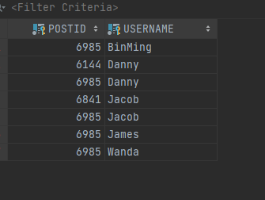
  - Web result:
    
    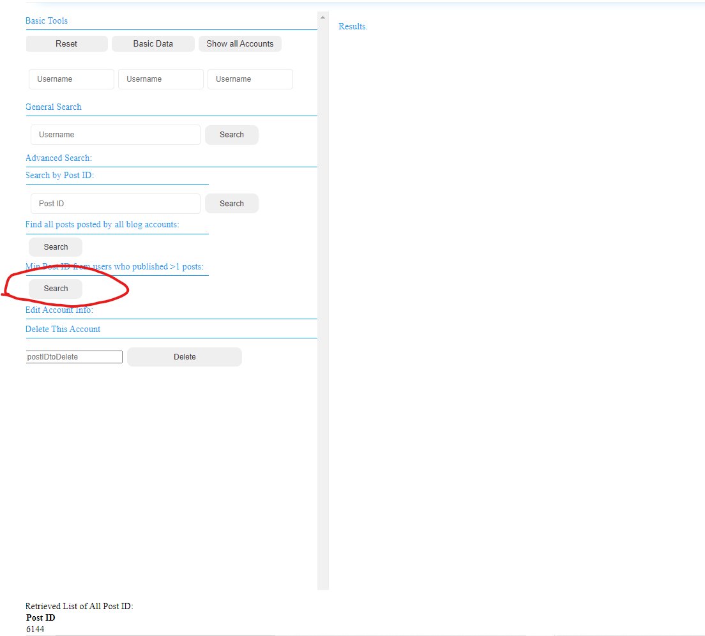
#
## Queries: Division
In Customer.php
- Query:
SELECT DISTINCT P.POSTID FROM PUBLISH P WHERE NOT EXISTS (SELECT B.USERNAME FROM BLOGACCOUNT B MINUS (SELECT P1.USERNAME FROM PUBLISH P1 WHERE (P1.POSTID = P.POSTID)))
  
- Publish Table:

- Blog Account Table:

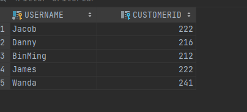
  - Web result:
    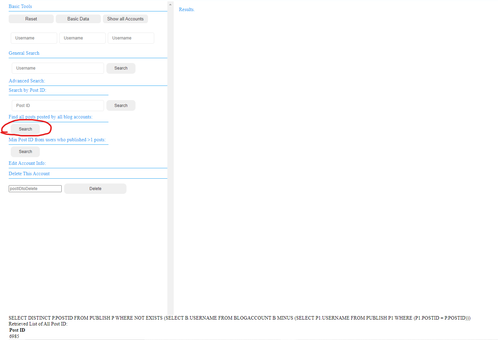
  